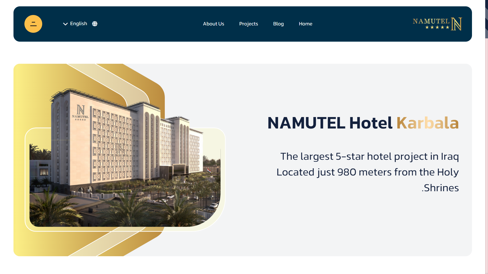
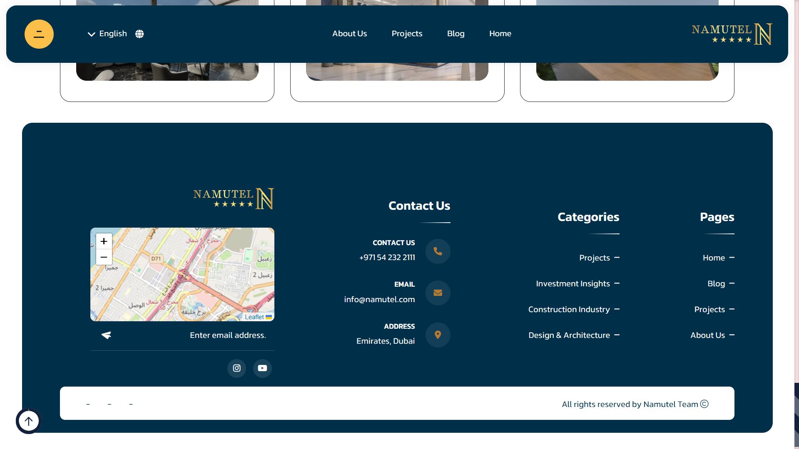

# The [Namutel](https://namutel.com) Landing

  

## Description

[Namutel](https://namutel.com) is a corporate website introducing the Namutel company based in Dubai, which specializes in the development of luxury hotels. This website serves as a presentation of the company's most important project and provides an overview of the company itself. It includes sections such as Articles, Projects, and About Us.
Below, you can see a few images from the website:

<!-- ### Download Demo App
[Demo App Android](https://example.com/) -->

## Screenshots

  
  
    

## Dependencies

### Packages

- Dotnet 8.0
- Sql Server 2019

 
## Collaborators

### Backend
- [Mahdi Hashemi](https://github.com/mahdi008397)

### FrontEnd
- [Amir Hosseiniii](https://github.com/amir-hosseiniii)

## Links

Support me on Instagram. ❤️

- [Instagram](https://instagram.com/M_programmer_H)
- [Telegram](https://t.me/M_programmer_H)
